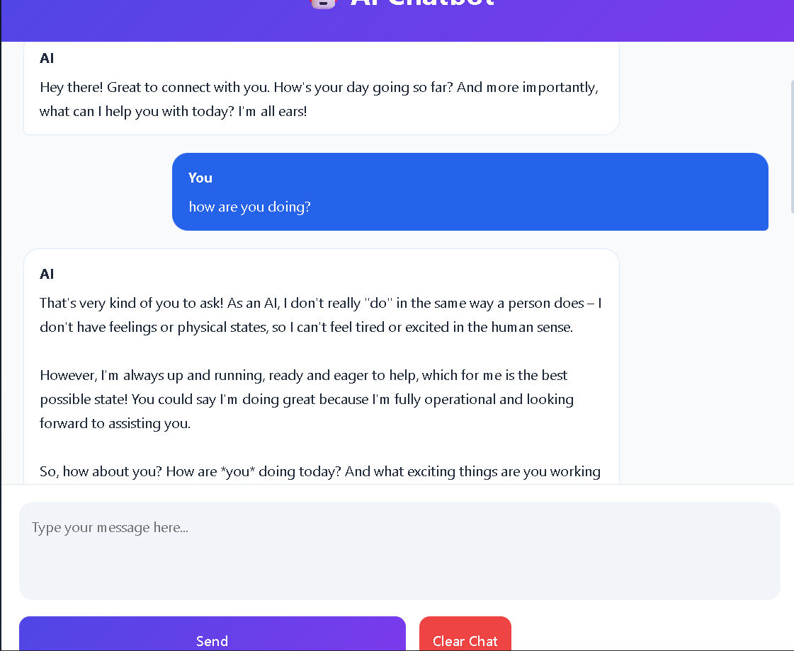

# Gemini AI Chatbot

A web-based AI chatbot built with **Python**, **Flask**, and the **Google Gemini API (Google AI Studio)**. The application provides an interactive chat interface, maintains conversation history during a session, and allows chatbot behavior to be customized using a JSON configuration file.

## Live Demo

https://chatbot-19yr.onrender.com

## Project Repository

https://github.com/MohammaddAnas/chatbot.git

## Screenshots

### Home Page




## Features

- AI-powered chatbot using Google Gemini API
- Session-based conversation history
- Flask backend
- Clean and responsive user interface
- Custom chatbot configuration using JSON
- Secure API key management with environment variables
- Jinja2 template rendering

## Technologies Used

### Backend

- Python
- Flask
- Google Gemini API (AI Studio)
- python-dotenv
- JSON

### Frontend

- HTML5
- CSS3
- Jinja2 Templates

 ## Project Structure

```text
CHATBOT/
│
├── screenshots/
│   └── home.png
│
├── static/
│   └── style.css
│
├── templates/
│   └── home.html
│
├── app.py
├── prompts.json
├── requirements.txt
├── .gitignore
└── README.md
```

> **Note:** The `.env` file is not included in this repository because it contains sensitive information such as API keys.

## Installation

Clone the repository.

```bash
git clone https://github.com/your-username/Gemini-Chatbot.git
```

Move into the project directory.

```bash
cd Gemini-Chatbot
```

Create a virtual environment.

```bash
python -m venv venv
```

Activate the virtual environment.

### Windows

```bash
venv\Scripts\activate
```

### Linux/macOS

```bash
source venv/bin/activate
```

Install the required packages.

```bash
pip install -r requirements.txt
```

## Environment Variables

Create a `.env` file in the project directory.

```env
API_KEY=YOUR_GEMINI_API_KEY
SECRET_KEY=YOUR_SECRET_KEY
```

## Running the Application

```bash
python app.py
```

Open your browser and visit:

```text
http://127.0.0.1:5000
```

## How It Works

1. The user sends a message from the web interface.
2. Flask processes the request using the POST method.
3. The conversation history is stored using Flask sessions.
4. The request is sent to the Google Gemini API.
5. Gemini generates a response.
6. Flask renders the updated conversation using Jinja2 templates.

## Concepts Used

- Flask Routing
- GET and POST Requests
- Session Management
- API Integration
- Environment Variables
- JSON Configuration
- Jinja2 Template Engine
- HTML and CSS

## Requirements

```
Flask
google-generativeai
python-dotenv
gunicorn
```

## Future Improvements

- User authentication
- Database integration
- Persistent chat history
- Multiple chatbot personalities
- File and image upload support
- Markdown rendering
- Dark mode
- Conversation export

## Author

**Mohammad Anas**

Computer Science Engineering Student

Interested in Backend Development, Artificial Intelligence, Full Stack Development, and Building Practical Web Applications.

## License

This project is intended for educational and portfolio purposes.
